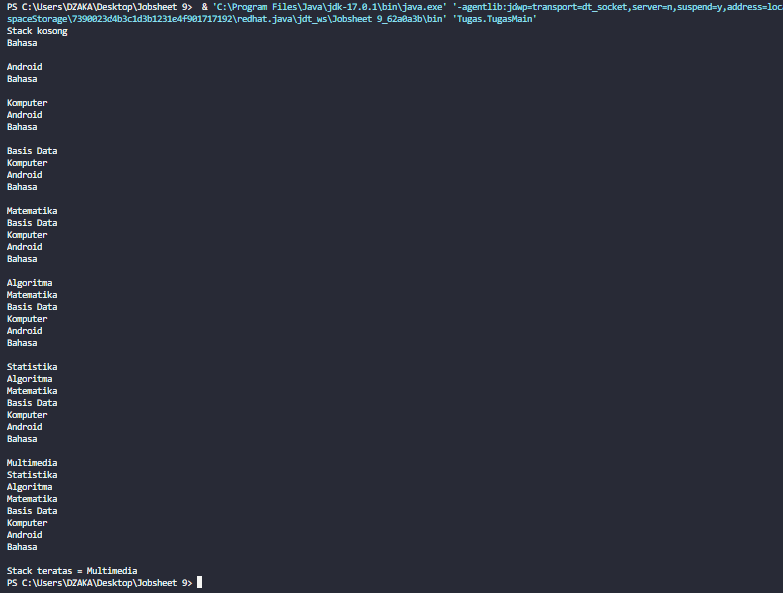

# JOBSHEET 9 : LINKED LIST
## NAMA: MUHAMMAD DZAKA MURRAN RUSID
## KELAS/ABS: 1F_D4-TI/18

### 1. Tujuan Praktikum
Setelah melakukan materi praktikum ini, mahasiswa mampu:
1. Membuat struktur data linked list
2. Membuat linked list pada program
3. Membedakan permasalahan apa yang dapat diselesaikan menggunakan linked list

### 2. Praktikum

#### 2.1 Pembuatan Single Linked List
Waktu percobaan : 30 menit

Didalam praktikum ini, kita akan mempraktekkan bagaimana membuat Single Linked List dengan 
representasi data berupa Node, pengaksesan linked list dan metode penambahan data.
1. Pada Project StrukturData yang sudah dibuat pada Minggu sebelumnya, buat package dengan 
nama minggu11
2. Tambahkan class-class berikut:
a. Node.java
b. SingleLinkedList.java
c. SLLMain.java
3. Implementasi class Node
4. Tambahkan atribut pada class SingleLinkedList
5. Sebagai langkah berikutnya, akan diimplementasikan method-method yang terdapat pada 
SingleLinkedList.
6. Tambahkan method isEmpty().
7. Implementasi method untuk mencetak dengan menggunakan proses traverse.
8. Implementasikan method addFirst().
9. Implementasikan method addLast().
10. Implementasikan method insertAfter, untuk memasukkan node yang memiliki data 
input setelah node yang memiliki data key.
11. Tambahkan method penambahan node pada indeks tertentu.
12. Pada class SLLMain, buatlah fungsi main, kemudian buat object dari class SingleLinkedList.
13. Tambahkan Method penambahan data dan pencetakan data di setiap penambahannya agar 
terlihat perubahannya

```java
package minggu11; //node.java

public class Node{
    int data;
    Node next;

    public Node(int nilai, Node berikutnya){
        this.data=nilai;
        this.next=berikutnya;
    }
}


package minggu11; //SingleLinkedList.java

public class SingleLinkedList {
    Node head; 
    Node tail;

    public boolean isEmpty(){
        return head == null;
    }

    public void print(){
        if(!isEmpty()){
            Node tmp = head;
            System.out.print("Isi Linked List:\t");
            while(tmp != null){
                System.out.print(tmp.data + "\t");
                tmp = tmp.next;
            }
            System.out.println("");
        }else{
            System.out.println("Linked list kosong");
        }
    }

    public void addFirst(int input){
        Node ndInput = new Node(input, null);
        if(isEmpty()){
            head = ndInput;
            tail = ndInput;
        }else{
            ndInput.next = head;
            head = ndInput;
        }
    }

    public void addLast(int input){
        Node ndInput = new Node(input, null);
        if(isEmpty()){
            head = ndInput;
            tail = ndInput;
        }else{
            tail.next = ndInput;
            tail = ndInput;
        }
    }

    public void insertAfter(int key, int input){
        Node ndInput =  new Node(input, null);
        Node temp = head;
        do{
            if(temp.data == key){
                ndInput.next = temp.next;
                temp.next = ndInput;
                if(ndInput.next==null);
                tail=ndInput;
                break;
            }
            temp = temp.next;
        }while (temp != null);
    }

    public void insertAt(int index, int input){
        if(index<0){
            System.out.println("indeks salah");
        }else if(index == 0){
            addFirst(input);
        }else{
            Node temp = head;
            for(int i=0;i<index-1; i++){
                temp = temp.next;
            }
            temp.next = new Node(input, temp.next);
            if(temp.next.next==null){
                tail=temp.next;
            }
        }
    }
}


package minggu11; //SLLMain.java

public class SLLMain {
    public static void main(String[] args){
        SingleLinkedList singLL = new SingleLinkedList();
        singLL.print();
        singLL.addFirst(890);
        singLL.print();
        singLL.addLast(760);
        singLL.print();
        singLL.addFirst(700);
        singLL.print();
        singLL.insertAfter(700, 999);
        singLL.print();
        singLL.insertAt(3, 833);
        singLL.print();
    }
}

```

#### 2.1.1 Verifikasi Hasil Percobaan


#### 2.1.2 Pertanyaan
1. Mengapa hasil compile kode program di baris pertama menghasilkan “Linked List Kosong”?

```
Jawaban: Karena isi pada linked list tersebut memang tidak ada atau tidak diisi sehingga yang di-print kosong.
```

2. Pada step 10, jelaskan kegunaan kode berikut

```java
ndInput.next = temp.next;
   temp.next = ndInput;
```

```
Jawaban: Menyimpan variabel ndInput.next ke temporary dan temp.next memasukkannya ke dalam ndInput untuk agar data linked list tersebut diubah
```
3. Perhatikan class SingleLinkedList, pada method insertAt Jelaskan kegunaan kode berikut 
```java
if(temp.next.next==null){
    tail=temp.next;
```

```
Jawaban: Jika temp.next.next (**temporary** setelah setelahnya null) null, maka tail akan dimasukkan nilai dari temp.next
```
### 2.2 Modifikasi Elemen pada Single Linked List
Waktu percobaan : 30 menit
Didalam praktikum ini, kita akan mempraktekkan bagaimana mengakses elemen, mendapatkan 
indeks dan melakukan penghapusan data pada Single Linked List.: 
#### 2.2.1 Langkah-langkah Percobaan
1. Implementasikan method untuk mengakses data dan indeks pada linked list
2. Tambahkan method untuk mendapatkan data pada indeks tertentu pada class Single 
Linked List
3. Implementasikan method indexOf.
4. Tambahkan method removeFirst pada class SingleLinkedList
5. Tambahkan method untuk menghapus data pada bagian belakang pada class 
SingleLinkedList
6. Sebagai langkah berikutnya, akan diimplementasikan method remove
7. Implementasi method untuk menghapus node dengan menggunakan index.
8. Kemudian, coba lakukan pengaksesan dan penghapusan data di method main pada class 
SLLMain dengan menambahkan kode berikut
9. Method SLLMain menjadi:
10. Jalankan class SLLMain 


#### 2.2.2 Verifikasi Hasil Percobaan


#### 2.2.3 Pertanyaan
1. Mengapa digunakan keyword break pada fungsi remove? Jelaskan!
```
agar program dihentikan setelah menghapus datanya dan tidak dilanjutkan ke data lain

```
2. Jelaskan kegunaan kode dibawah pada method remove

```
else if(temp.next.data == key){
    temp.next = temp.next.next;
}
```

```
Jawaban: Jika node punya data yang sama dengan key, maka posisi nya digantikan oleh node selanjutnya
```
3. Apa saja nilai kembalian yang dapat dikembalikan pada method indexOf? Jelaskan maksud 
masing-masing kembalian tersebut!

```
Jika temp = kosong maka mengembalikan index -1 yang berarti semua index tidak ada datanya. Selain itu akan mengembalikan index data yang di key
```

### 3. Tugas
Waktu pengerjaan : 50 menit

1 Buat method insertBefore untuk menambahkan node sebelum keyword yang diinginkan 

**Jawaban:**

```java
public void insertBefore(int key, int input){ //method insertbefore di SingleLinkedLIst.java
        Node ndInput = new Node(input,null);
        Node temp = head;
        do{
            if((temp.data == key) && (temp == head)){
                addFirst(input);
                break;
            } else {
                ndInput.next = temp.next;
                temp.next = ndInput;
                if(ndInput.next == null) tail = ndInput;
                break;
            }
        } while (temp != null);
    }

 singLL.insertBefore(700, 666); //pemaganggilan insertbefore di SingleLInkedList.java
        singLL.print();
```

**OUTPUT**


2 Implementasikan ilustrasi Linked List Berikut. Gunakan 4 macam penambahan data yang telah dipelajari sebelumnya untuk menginputkan data.
```java
package Tugas2; //node.java

public class node {
    String data;
    node next;
    
    public node(String nilai, node berikutnya){
        this.data = nilai;
        this.next = berikutnya;
    }
}

package Tugas2; //singlelinkedlist.java

public class singlelinkedlist {
    node head; //posisi awal linked list
    node tail; //posisi awal linked list
    
    public boolean isEmpty(){
        return head == null;
    }
    
    public void print(){
        if(!isEmpty()){
            node tmp = head;
            System.out.print("Isi Linked List:\t");
            while (tmp != null){
                System.out.print(tmp.data + "\t");
                tmp = tmp.next;
            }
            System.out.println("");
        } else {
            System.out.println("Linked List kosong");
        }
    }
    
    public void addFirst(String input){
        node ndInput = new node(input, null);
        if(isEmpty()){ //jika Linked List Kosong
            head = ndInput; //head dan tail sama dengan node input
            tail = ndInput;
        } else {
            ndInput.next = head;
            head = ndInput;
        }
    }
    
    public void addLast(String input){
        node ndInput = new node(input, null);
        if(isEmpty()){ 
            head = ndInput; //head dan tail sama dengan node input
            tail = ndInput;
        } else {
            tail.next = ndInput;
            tail = ndInput;
        }
    }
    
    public void insertBefore(String key, String input){
        node ndInput = new node(input,null);
        node temp = head;
        do{
            if((temp.data == key) && (temp == head)){
                addFirst(input);
                break;
            } else if (temp.next.data == key){
                ndInput.next = temp.next;
                temp.next = ndInput;
                break;
            }            
            temp = temp.next;
        } while (temp != null);
    }
    
    public void insertAfter(String key, String input){
        node ndInput = new node(input,null);
        node temp = head;
        do {
            if(temp.data == key){
                ndInput.next = temp.next;
                temp.next = ndInput;
                if(ndInput.next == null) tail = ndInput;
                break;
            }
            temp = temp.next;
        } while (temp != null);
    }
    
    public void insertAt(int index, String input){
        if(index < 0){
            System.out.println("Indeks salah");
        } else if (index == 0){
            addFirst(input);
        } else {
            node temp = head;
            for (int i = 0; i < index - 1; i++){
                temp = temp.next;
            }
            temp.next = new node(input, temp.next);
            if(temp.next.next == null) tail = temp.next;
        }
    }
    
    public void removeFirst(){
        if(isEmpty()){
            System.out.println("Linked list masih kosong, tidak dapat dihapus");
        } else if (head == tail){
            head = tail = null;
        } else {
            head = head.next;
        }
    }
    
    public void removeLast(){
        if(isEmpty()){
            System.out.println("Linked list masih kosong, tidak dapat dihapus");
        } else if (head == tail){
            head = tail = null;
        } else {
            node temp = head;
            while (temp.next != tail){
                temp = temp.next;
            }
            temp.next = null;
            tail = temp;
        }
    }
    
    public void remove(String key){
        if(isEmpty()){
            System.out.println("Linked list masih kosong, tidak dapat dihapus");
        } else {
            node temp = head;
            while (temp != null){
                if((temp.data == key) && (temp == head)){
                    this.removeFirst();
                    break;
                } else if (temp.next.data == key) {
                    temp.next = temp.next.next;
                    if(temp.next == null){
                        tail = temp;
                    }
                    break;
                }
                temp = temp.next;
            }
        }
    }
    
    public void removeAt(int index){
        if (index == 0) {
            removeFirst();
        } else {
            node temp = head;
            for (int i = 0; i < index - 1; i++){
                temp = temp.next;
            }
            temp.next = temp.next.next;
            if (temp.next == null){
                tail = temp;
            }
        }
    }
}

package Tugas2; //SLLMain.java

public class SLLMain {
    public static void main(String[] args) {
        singlelinkedlist singLL = new singlelinkedlist();
        
        singLL.print();
        singLL.addFirst("a");
        singLL.print();
        singLL.addLast("e");
        singLL.print();
        singLL.insertAfter("a", "b");
        singLL.print();
        singLL.insertAt(2, "c");
        singLL.print();
        singLL.insertBefore("e", "d");
        singLL.print();
        
        }
}

```

**Output**


3 Buatlah Implementasi Stack berikut menggunakan Single Linked List
```java
Jawaban:

package Tugas;

public class TugasMain{ //TugasMain.java
        public static void main(String[] args) {
            TugasStackLink nd = new TugasStackLink();
            
            nd.print();
            nd.push("Bahasa");
            nd.print();
            nd.push("Android");
            nd.print();
            nd.push("Komputer");
            nd.print();
            nd.push("Basis Data");
            nd.print();
            nd.push("Matematika");
            nd.print();
            nd.push("Algoritma");
            nd.print();
            nd.push("Statistika");
            nd.print();
            nd.push("Multimedia");
            nd.print();
            nd.peek();
            
        }
    }

package Tugas;

public class TugasStackLink { //TugasStackLink.java
        TugasStackSLL top;  
        
        public boolean isEmpty(){
            return top == null;
        }
    
        public void push(String input){
            TugasStackSLL temp = new TugasStackSLL(input, null);
            if(isEmpty()){ 
                top = temp; 
            } else {
                temp.next = top;
                top = temp;
            }
        }
        
        public void pop(){
            if(isEmpty()){
                System.out.println("Stack kosong");
                return;
            } 
            top = top.next;
            }
        
        public void peek(){
            if(!isEmpty()){
                TugasStackSLL temp = top;
                System.out.println("Stack teratas = " + top.data);
            }else{
                System.out.println("Stack kosong");
            }
        }
        
        public void print(){
            if(isEmpty()){
                System.out.println("Stack kosong");
            } else { 
                TugasStackSLL temp = top;
                while(temp != null){
                    System.out.println(temp.data + "\t");
                    temp = temp.next;
                }
                System.out.println("");
            }
        }
}
    

package Tugas;

public class TugasStackSLL { //TugasStackSLL.java
        String data;
        TugasStackSLL next;
        
        public TugasStackSLL(String nilai, TugasStackSLL lanjut){
            this.data = nilai;
            this.next = lanjut;
        }
    
    }
```
**OUTPUT**



4 Buatlah implementasi program antrian untuk mengilustasikan mahasiswa yang sedang meminta 
tanda tangan KRS pada dosen DPA di kampus pada tugas jobsheet 8 menggunakan LinkedList.
Implementasikan Queue pada antrian mahasiswa dengan menggunakan konsep LinkedList
```
Jawaban:
```

```java
package Tugas;

    public class MahasiswaL {
        String nim;
        String nama;
        int absen;
        double ipk;
        MahasiswaL next;
        
        public MahasiswaL(String nim, String nama, int absen, double ipk, MahasiswaL lanjut){
            this.nim = nim;
            this.nama = nama;
            this.absen = absen;
            this.ipk = ipk;
            this.next = lanjut;
        }    
    }
```

```java
package Tugas;

import java.util.Scanner;
public class MahasiswaMain {
        public static void menu(){
            System.out.println("Pilih menu: ");
            System.out.println("1. Data Mahasiswa baru");
            System.out.println("2. Data Mahasiswa keluar");
            System.out.println("3. Cek data mahasiswa terdepan");
            System.out.println("4. Cek data mahasiswa paling belakang");
            System.out.println("5. Cek semua antrian");
            System.out.println("6. Cari penempatan mahasiswa berdasar absen");
            System.out.println("7. Cari mahasiswa dengan indeks");
            System.out.println("8. Clear data");
            System.out.println("==============");
        }
    
        public static void main(String[] args) {
            Scanner sc = new Scanner(System.in);
            Scanner s = new Scanner(System.in);
            
            System.out.print("Masukkan kapasitas Queue: ");
            int jumlah = sc.nextInt();
            
            MahasiswaSLL antri = new MahasiswaSLL();
            
            int pilih;
            
            do{
                menu();
                pilih = sc.nextInt();
                sc.nextLine();
                switch(pilih){
                    case 1:
                        System.out.print("NIM: ");
                        String nim = sc.nextLine();
                        System.out.print("Nama: ");
                        String nama = sc.nextLine();
                        System.out.print("Absen: ");
                        int absen = s.nextInt();
                        System.out.print("IPK: ");
                        double ipk = s.nextDouble();
                        antri.enqueue(nim, nama, absen, ipk);
                        break;
                    
                    case 2:
                        antri.dequeue();
                        break;
                    
                    case 3:
                        antri.peek();
                        break;
                    
                    case 4:
                        antri.peekRear();
                        break;
                        
                    case 5:
                        antri.print();
                        break;
                        
                    case 6:
                        System.out.print("Masukkan absen mahasiswa: ");
                        int absene = s.nextInt();
                        antri.peekData(absene);
                        break;
                        
                    case 7:
                        System.out.print("Masukkan indeks yang dicari: ");
                        int indeks = s.nextInt();
                        antri.peekIndex(indeks);
                        break;
                     
                    case 8: 
                        antri.clear(jumlah);
                        break;
                }
            }while (pilih == 1 || pilih == 2 || pilih == 3 || pilih == 4 || pilih == 5 || pilih == 6 || pilih == 7 || pilih == 8);
        }
    }
```

```java
package Tugas;

    public class MahasiswaSLL {
        MahasiswaL head;
        MahasiswaL tail;
        
            
        public boolean isEmpty(){
            return head == null;
        }
    
        public void print(){
            if(!isEmpty()){
                MahasiswaL temp = head;
                int i = 0;
                System.out.print("Isi Mahasiswa:\t");
                while (temp != null){
                    System.out.println("Data Mahasiswa ke-" + i + "= " + temp.nim + " " + temp.nama + " " + temp.absen
                    + " " + temp.ipk);
                    temp = temp.next;
                    i++;
                }
                System.out.println("");
            } else {
                System.out.println("Queue kosong");
            }
        }
    
        public void peek(){
            if(!isEmpty()){
                MahasiswaL temp = head;
                System.out.println("Data mahasiswa terdepan= " + temp.nim + " " + temp.nama + " " + temp.absen
                    + " " + temp.ipk);
            } else {
                System.out.println("Queue kosong");
            }
        }
        
        public void peekRear(){
            if(!isEmpty()){
                MahasiswaL temp = head;
                while(temp != null){
                    if(temp == tail){
                        System.out.println("Antrian paling belakang = " + temp.nim + " " + temp.nama + " " + temp.absen
                    + " " + temp.ipk);
                    }else {
                        System.out.println("Queue kosong");
                    }
                    temp = temp.next;
                }
            }
        }
        
        public void peekIndex(int index){
            MahasiswaL temp = head;
            for (int i = 0; i < index - 1; i++){
                    temp = temp.next;
                }
            System.out.println("Data mahasiswa pada indeks ke-" + index + "= " + temp.nim + " " + temp.nama + " " + temp.absen
                    + " " + temp.ipk);
        }
        
        public int peekData(int key){
            MahasiswaL temp = head;
            int index = 0;
            while (temp != null && temp.absen != key){
                temp = temp.next;
                index++;
            }
            if(temp == null){
                System.out.println("Queue kosong");
                return -1;
            } else {
                System.out.println("Data mahasiswa " + key + "berada pada index ke-" + index);
                System.out.println("Data mahasiswa " + temp.nim + " " + temp.nama + " " + temp.absen
                    + " " + temp.ipk);
                return index;
            }
        }
    
        
        public void enqueue(String nim, String nama, int absen, double ipk){
            MahasiswaL temp = new MahasiswaL(nim, nama, absen, ipk, null);
            if(isEmpty()){ 
                head = temp; 
                tail = temp;
            } else {
                tail.next = temp;
                tail = temp;
            }
        }
        
        public void dequeue(){
            if(isEmpty()){
                System.out.println("Queue, tidak dapat dihapus");
            } else if (head == tail){
                head = tail = null;
            } else {
                head = head.next;
            }
        }
        
        public void clear(int data){
            if(!isEmpty()){
                head = tail = null;
                data = 0;
                System.out.println("Data mahasiswa dikosongkan");
            } else {
                System.out.println("Queue Kosong");
            }
        }
        
        
    }

```

"OUTPUT:"

